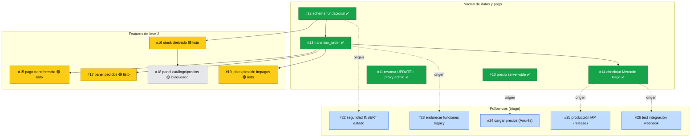

# Roadmap — PRD #9 (Fase 2: checkout MP + transferencia + panel /empleados)

Generado: 2026-06-15

## Estado

| # | Issue | Estado | Depende de |
|---|-------|--------|------------|
| #10 | Precio server-side | ✅ cerrado | — |
| #11 | Revocar UPDATE + guarda proxy admin | ✅ cerrado | — |
| #12 | Schema fundacional fase 2 | ✅ cerrado | — |
| #13 | `transition_order` | ✅ cerrado | #12 |
| #14 | Checkout Mercado Pago | ✅ cerrado | #13 |
| #15 | Pago por transferencia | 🟢 listo | #13 ✅ |
| #16 | Stock disponible derivado | 🟢 listo | #12 ✅ |
| #17 | Panel /empleados: pedidos | 🟢 listo | #13 ✅ |
| #18 | Panel /empleados: catálogo/precios/stock | 🟡 bloqueado | #16 |
| #19 | Job de expiración de impagos | 🟢 listo | #13 ✅ |
| #22 | Seguridad: estado inicial en INSERT | ⬜ triage | — |
| #23 | Endurecer funciones legacy | ⬜ triage | — |
| #24 | Cargar precios validados (Andrés) | ⬜ triage | — |
| #25 | Producción MP (antes del release) | ⬜ triage | bloqueante release |
| #26 | Test de integración del webhook | ⬜ ready-for-agent | — |

Leyenda: ✅ cerrado · 🟢 abierto y desbloqueado · 🟡 abierto y bloqueado · ⬜ follow-up.
